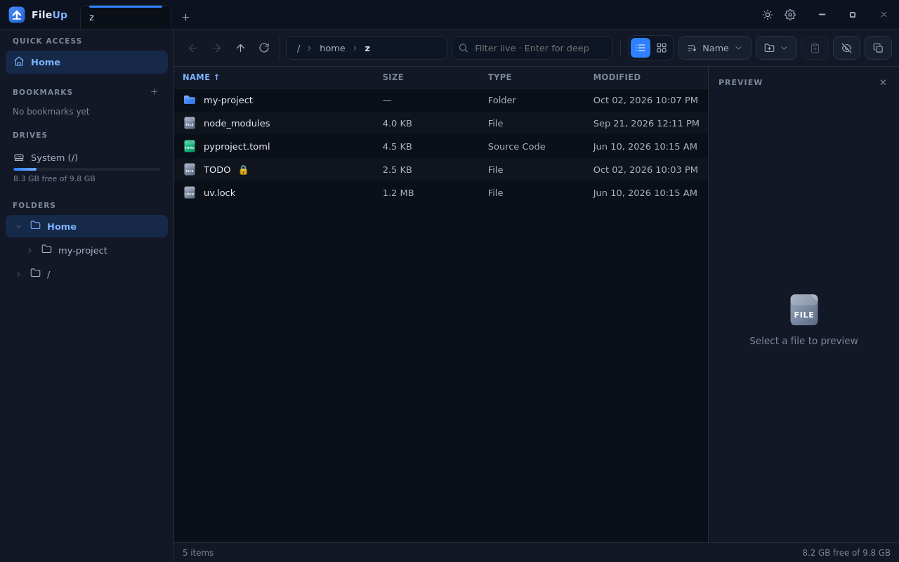
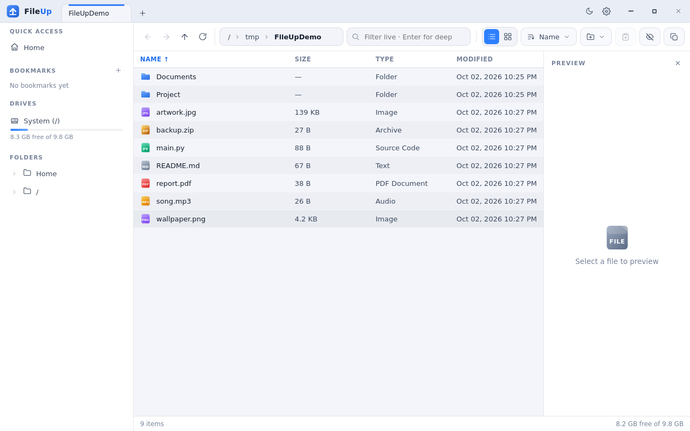
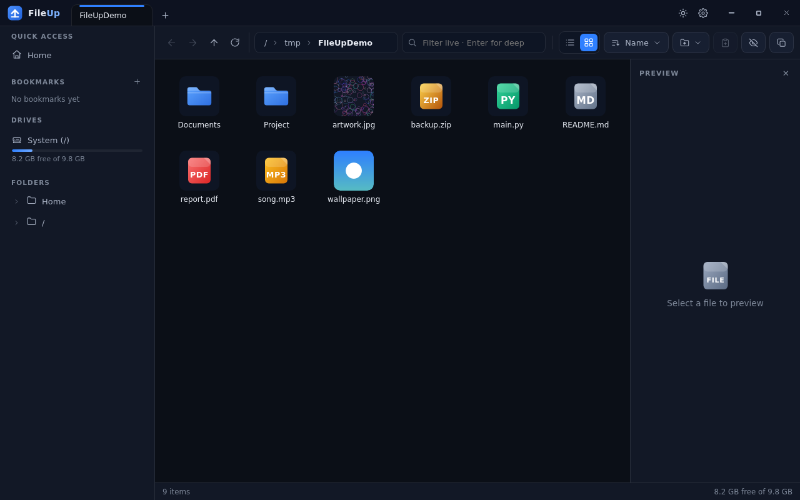

#  💡 Help 💡
### 1️⃣ readme's :
- [readme.md = English](https://github.com/The-Lxx-CLoUD/FileUp#-fileup--a-modern-file-manager-for-windows-and-linux)
- [readme.md = Persian](https://github.com/The-Lxx-CLoUD/FileUp#-fileup--%D9%85%D8%AF%DB%8C%D8%B1-%D9%81%D8%A7%DB%8C%D9%84-%D9%85%D8%AF%D8%B1%D9%86-%D8%A8%D8%B1%D8%A7%DB%8C-%D9%88%DB%8C%D9%86%D8%AF%D9%88%D8%B2-%D9%88-%D9%84%DB%8C%D9%86%D9%88%DA%A9%D8%B3)

### 2️⃣ Run Source :
 - [Run Source = English]((help-file)/RunSource's/run-Sourse-en.md)
 - [Run Source = Persian]((help-file)/RunSource's/run-Source-fa.md)

### 3️⃣ Download and Use for windows/linux :
- [Use and Download = English]((help-file)/D-md/Download-Use-en.md)
- [Use and Download = Persian]((help-file)/D-md/Download-Use-fa.md)
---

# 📂 FileUp — A Modern File Manager for Windows and Linux

**Developer: TheLxxCLoUD** — Telegram: [@lxxcloud](https://t.me/lxxcloud)

FileUp is a fast, beautiful, and highly professional file manager built with **Electron + React + Node.js**, running on **Windows** and **Linux**.





---

## ✨ Features

| Feature | Description |
|---|---|
| 🗂 **Multiple tabs** | Several folders at once, like a browser — `Ctrl+T` and `Ctrl+W` |
| 🔍 **Live + recursive search** | Instant filtering as you type, plus deep search through all subfolders with `Enter` (supports `*.txt` and `?`) |
| 🎨 **Dark and light themes** | Two complete themes with instant switching, no restart needed |
| 🖼 **Preview and thumbnails** | Image thumbnails in grid view + a preview panel (image / text / metadata) |
| ✂️ **Complete file operations** | Copy, cut, paste, rename, new folder/file, internal and external Drag & Drop |
| 🗑 **Three ways to delete** | Standard Recycle Bin, permanent delete, **3-pass secure delete (Shredder)** |
| 🔢 **Batch Rename** | Bulk rename: numbering, find & replace (with Regex), prefix/suffix, upper/lower case + live preview |
| 👯 **Duplicate finder** | Find duplicate files by MD5 hash + free up space with one click |
| 🔐 **Checksum** | Calculate MD5 / SHA1 / SHA256 with a progress bar |
| 📌 **Bookmarks** | Permanently save frequently used folders in the sidebar |
| 🌲 **Folder tree** | Full sidebar: quick access + bookmarks + drives with usage bars + recursive tree |
| 🖥 **Table and grid views** | Column sorting, show hidden files, colored icons for 15 file types |
| ⌨️ **Full keyboard shortcuts** | Every operation available from the keyboard |
| 🧭 **Smart path bar** | Clickable breadcrumb + edit the path directly with a double-click |
| 💾 **Saved settings** | Theme, view, sorting, bookmarks, and even window size |

---


## ⌨️ Keyboard Shortcuts

| Shortcut | Action |
|---|---|
| `Ctrl+T` / `Ctrl+W` | New tab / Close tab |
| `Ctrl+1` / `Ctrl+2` | Table view / Grid view |
| `Ctrl+F` | Focus the search box |
| `Enter` (in search) | Deep recursive search |
| `Ctrl+C` / `X` / `V` | Copy / Cut / Paste |
| `F2` | Rename |
| `Delete` | Move to Recycle Bin |
| `Shift+Delete` | Secure delete (Shredder) |
| `Ctrl+A` | Select all |
| `Ctrl+H` | Show/hide hidden files |
| `Ctrl+Shift+N` | New folder |
| `Alt+←` / `Alt+→` | Back / Forward |
| `Alt+↑` or `Backspace` | Parent folder |
| `F5` | Refresh |

---

## 🏗 Project Structure

```
FileUp/
├── main/                 ← Electron main process (filesystem backend)
│   ├── main.cjs          ← Entry point, window, geometry persistence
│   ├── preload.cjs       ← Secure contextBridge
│   ├── ipc.cjs           ← All IPC handlers
│   ├── fsops.cjs         ← Listing, copy/move, drives, conflicts
│   ├── tasks.cjs         ← Search, duplicate finder, Shredder, hashing
│   ├── naming.cjs        ← Pure naming logic (testable)
│   └── store.cjs         ← Settings + bookmarks (JSON)
├── src/renderer/         ← React user interface
│   └── src/
│       ├── store.jsx     ← Central store (tabs, selection, dialogs)
│       ├── components/   ← TitleBar, Sidebar, Toolbar, FileView, Dialogs…
│       └── styles/       ← Dark/light themes (CSS Variables)
├── scripts/              ← Logic tests + utilities
├── build/                ← Icons (ico/png)
└── electron-builder.yml  ← Installer configuration
```

**Security:** `contextIsolation: true` + `nodeIntegration: false` — the renderer has no direct access to Node and communicates with the main process only through a restricted IPC bridge.

---

## 🛡 Technical Notes

- **Secure delete:** Overwrites 3 times (random data + zeros) → random rename → delete. On SSDs, deletion is not 100% guaranteed due to wear-leveling (use full-disk encryption for absolute security).
- **Copy/move conflicts:** Replace All / Keep Both / Skip All dialog
- **Drives:** Windows (A–Z) + Linux (parsing `/proc/mounts`)
- **Recycle Bin:** Each operating system's standard (`shell.trashItem`)

---
[👉🔰Installation and usage steps training🔰👈](https://github.com/The-Lxx-CLoUD/FileUp#3%EF%B8%8F%E2%83%A3-download-and-use-for-windowslinux-)
---
© 2026 **TheLxxCLoUD** — Released under the [MIT License](LICENSE).


#


<div dir="rtl">

# 📂 FileUp — مدیر فایل مدرن برای ویندوز و لینوکس

**توسعه‌دهنده: TheLxxCLoUD** — تلگرام: [@lxxcloud](https://t.me/lxxcloud)


---

## ✨ امکانات

| ویژگی | توضیح |
|---|---|
| 🗂 **تب‌های چندگانه** | چند پوشه همزمان مثل مرورگر — `Ctrl+T` و `Ctrl+W` |
| 🔍 **جستجوی زنده + بازگشتی** | فیلتر لحظه‌ای حین تایپ + جستجوی عمیق در تمام زیرپوشه‌ها با `Enter` (پشتیبانی از `*.txt` و `?`) |
| 🎨 **تم دارک و لایت** | دو تم کامل با سوییچ فوری بدون ری‌استارت |
| 🖼 **پیش‌نمایش و تامبنیل** | تامبنیل تصاویر در حالت گرید + پنل پیش‌نمایش (تصویر / متن / متادیتا) |
| ✂️ **کامل‌ترین عملیات فایل** | کپی، برش، چسباندن، تغییرنام، پوشه/فایل جدید، Drag & Drop داخلی و از خارج برنامه |
| 🗑 **سه روش حذف** | سطل زباله استاندارد، حذف دائمی، **حذف امن (Shredder) سه‌مرحله‌ای** |
| 🔢 **Batch Rename** | تغییرنام گروهی: شماره‌گذاری، جایگزینی (با Regex)، پیشوند/پسوند، بزرگ/کوچک‌سازی + پیش‌نمایش زنده |
| 👯 **تکراری‌یاب** | یافتن فایل‌های تکراری با هش MD5 + آزادسازی فضا با یک کلیک |
| 🔐 **Checksum** | محاسبه MD5 / SHA1 / SHA256 با نوار پیشرفت |
| 📌 **بوکمارک** | ذخیره دائمی پوشه‌های پرکاربرد در سایدبار |
| 🌲 **درخت پوشه‌ها** | سایدبار کامل: دسترسی سریع + بوکمارک‌ها + درایوها با نوار مصرف فضا + درخت بازگشتی |
| 🖥 **نمای جدول و گرید** | مرتب‌سازی ستونی، نمایش فایل‌های مخفی، آیکون‌های رنگی ۱۵ نوع فایل |
| ⌨️ **میانبرهای کامل** | همه عملیات با کیبورد |
| 🧭 **نوار مسیر هوشمند** | Breadcrumb قابل کلیک + ویرایش مستقیم مسیر با دابل‌کلیک |
| 💾 **ذخیره تنظیمات** | تم، نما، مرتب‌سازی، بوکمارک‌ها و حتی ابعاد پنجره |


## ⌨️ میانبرهای کیبورد

| میانبر | عمل |
|---|---|
| `Ctrl+T` / `Ctrl+W` | تب جدید / بستن تب |
| `Ctrl+1` / `Ctrl+2` | نمای جدول / گرید |
| `Ctrl+F` | فوکوس روی جستجو |
| `Enter` (در جستجو) | جستجوی بازگشتی عمیق |
| `Ctrl+C` / `X` / `V` | کپی / برش / چسباندن |
| `F2` | تغییرنام |
| `Delete` | انتقال به سطل زباله |
| `Shift+Delete` | حذف امن (Shredder) |
| `Ctrl+A` | انتخاب همه |
| `Ctrl+H` | نمایش/مخفی فایل‌های مخفی |
| `Ctrl+Shift+N` | پوشه جدید |
| `Alt+←` / `Alt+→` | عقب / جلو |
| `Alt+↑` یا `Backspace` | پوشه بالاتر |
| `F5` | رفرش |

---

## 🏗 ساختار پروژه

```
FileUp/
├── main/                 ← پردازش اصلی Electron (بک‌اند فایل‌سیستم)
│   ├── main.cjs          ← نقطه ورود، پنجره، ذخیره هندسه
│   ├── preload.cjs       ← پل امن contextBridge
│   ├── ipc.cjs           ← تمام هندلرهای IPC
│   ├── fsops.cjs         ← لیست، کپی/انتقال، درایوها، تعارض‌ها
│   ├── tasks.cjs         ← جستجو، تکراری‌یاب، Shredder، هش
│   ├── naming.cjs        ← منطق خالص نام‌گذاری (قابل تست)
│   └── store.cjs         ← تنظیمات + بوکمارک‌ها (JSON)
├── src/renderer/         ← رابط کاربری React
│   └── src/
│       ├── store.jsx     ← استور مرکزی (تب‌ها، انتخاب، دیالوگ‌ها)
│       ├── components/   ← TitleBar, Sidebar, Toolbar, FileView, Dialogs…
│       └── styles/       ← تم دارک/لایت (CSS Variables)
├── scripts/              ← تست منطق + ابزارها
├── build/                ← آیکون‌ها (ico/png)
└── electron-builder.yml  ← پیکربندی نصب‌کننده‌ها
```

**امنیت:** `contextIsolation: true` + `nodeIntegration: false` — رندرر هیچ دسترسی مستقیمی به Node ندارد و فقط از طریق پل IPC محدودشده با پروسه اصلی صحیح ارتباط برقرار می‌کند.

---

## 🛡 نکات فنی

- **حذف امن:** بازنویسی ۳ بار (داده تصادفی + صفر) → تغییرنام تصادفی → حذف. روی SSD به‌دلیل wear-leveling حذف ۱۰۰٪ تضمینی نیست (برای امنیت مطلق از رمزنگاری دیسک استفاده کنید).
- **تعارض کپی/انتقال:** دیالوگ Replace All / Keep Both / Skip All
- **درایوها:** ویندوز (A-Z) + لینوکس (پارس `/proc/mounts`)
- **سطل زباله:** استاندارد هر سیستم‌عامل (`shell.trashItem`)


---
[👈🔰مراحل  نصب و استفاده🔰👉](https://github.com/The-Lxx-CLoUD/FileUp#3%EF%B8%8F%E2%83%A3-download-and-use-for-windowslinux-)
---
© 2026 **TheLxxCLoUD** — Released under the [MIT License](LICENSE).

</div>
